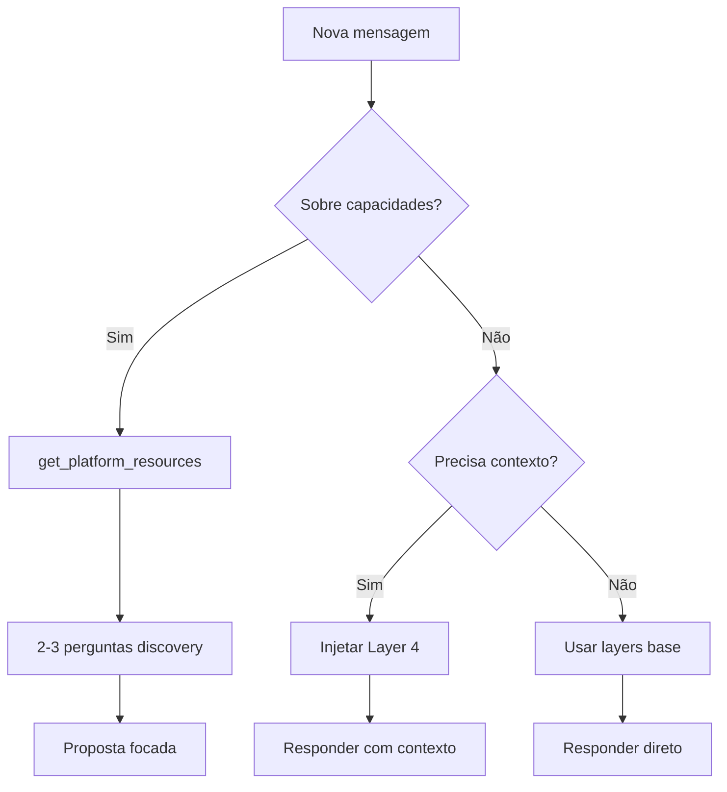

# Implementação de Prompts em Camadas - Guia Prático

## 🎯 Objetivo

Criar prompts eficientes que:
- ✅ Evitam sobrecarga de tokens
- ✅ Usam ferramentas corretamente
- ✅ Fazem discovery antes de propor
- ✅ Destacam diferencial do AssistOS

## 📊 Budget de Tokens

```
Layer 1 (Core):        ~150 tokens  ✅ Sempre incluído
Layer 2 (Role):        ~250 tokens  ✅ Sempre incluído  
Layer 3 (Patterns):    ~350 tokens  ✅ Sempre incluído
Layer 4 (Context):     ~500 tokens  ⚡ Just-in-time

TOTAL BASE:            ~750 tokens  (eficiente!)
TOTAL COM CONTEXT:     ~1250 tokens (quando necessário)
```

**Comparado com prompt monolítico**: 2000-3000 tokens
**Economia**: ~40-60% + contexto dinâmico

## 🏗️ Como Construir o Prompt Final

### Para AssistBuild:

```typescript
function buildAssistBuildPrompt(conversationContext?: ConversationContext): string {
  const layers = [
    readFileSync('packages/ai/agents/core/base-prompt.md'),           // Layer 1
    readFileSync('packages/ai/agents/core/assistbuild-role.md'),      // Layer 2
    readFileSync('packages/ai/agents/core/conversation-patterns.md'), // Layer 3
  ];
  
  // Layer 4: Context dinâmico (só quando relevante)
  if (conversationContext?.needsPlatformResources) {
    layers.push(generateContextLayer(conversationContext));
  }
  
  return layers.join('\n\n---\n\n');
}
```

### Para AssistME:

```typescript
function buildAssistMePrompt(conversationContext?: ConversationContext): string {
  const layers = [
    readFileSync('packages/ai/agents/core/base-prompt.md'),      // Layer 1
    readFileSync('packages/ai/agents/core/assistme-role.md'),    // Layer 2
    readFileSync('packages/ai/agents/core/conversation-patterns.md'), // Layer 3
  ];
  
  // Layer 4: Context operacional (quando necessário)
  if (conversationContext?.needsTenantState) {
    layers.push(generateOperationalContext(conversationContext));
  }
  
  return layers.join('\n\n---\n\n');
}
```

## ⚡ Quando Injetar Layer 4 (Context)

### AssistBuild Context:

```typescript
interface ConversationContext {
  needsPlatformResources: boolean;  // true se nova conversa sobre capacidades
  needsTenantState: boolean;         // true se precisa saber estado atual
  recentToolCalls: ToolCall[];       // últimas 3 tool calls
}

// Injetar context quando:
- Nova conversa (primeira mensagem)
- Utilizador pergunta "o que podes fazer"
- Vai propor módulos/features
- Passou > 10 mensagens desde última consulta
```

### AssistME Context:

```typescript
interface OperationalContext {
  activeModules: string[];    // Módulos ativos no tenant
  recentOrders: Order[];      // Últimas 5 encomendas
  pendingTasks: Task[];       // Tarefas pendentes
}

// Injetar context quando:
- Precisa de contexto operacional específico
- Vai executar ação crítica
- Utilizador pergunta sobre estado atual
```

## 🎨 Exemplo Prático: Resposta ANTES vs DEPOIS

### ❌ ANTES (Prompt Monolítico - 2500 tokens)

```
[500 tokens de capabilities genéricas]
[800 tokens de ferramentas disponíveis]
[600 tokens de regras e princípios]
[400 tokens de exemplos]
[200 tokens de contexto específico]

→ Resultado: Resposta genérica, lista de 20+ features
```

### ✅ DEPOIS (Prompts em Camadas - 750-1250 tokens)

```
Base (150t):     Identidade AssistOS + princípios
Role (250t):     AssistBuild + diferencial
Patterns (350t): Discovery flow + decision trees
Context (500t):  [Só se necessário] Platform resources

→ Resultado: Discovery → 2-3 perguntas → Proposta focada
```

## 📝 Template de Resposta Ideal

```typescript
// PASSO 1: Tool call (se nova conversa sobre capacidades)
const resources = await get_platform_resources();

// PASSO 2: Discovery (2-3 perguntas abertas)
const discoveryQuestions = [
  "Qual é o maior desafio da [EMPRESA] hoje?",
  "Que sistemas já usam atualmente?",
  "O que gostariam de automatizar primeiro?"
];

// PASSO 3: Proposta focada (baseada em resources REAIS)
const proposal = {
  greeting: "Ótima pergunta! Deixa-me consultar as capacidades...",
  discovery: discoveryQuestions.join('\n'),
  teaser: `
💡 Enquanto isso, destaco 3 capacidades únicas do AssistOS:

1. **[Feature Real ✅]** - [Descrição curta]
2. **[Feature Real ✅]** - [Descrição curta]
3. **[Podemos criar]** - [Descrição curta]
  `,
  cta: "Após entender melhor, posso propor solução específica!"
};

// PASSO 4: Responder
return formatResponse(proposal);
```

## 🔄 Fluxo de Decisão: Tool Usage



## 📐 Métricas de Sucesso

| Métrica | Antes | Depois | Melhoria |
|---------|-------|--------|----------|
| **Tokens prompt** | 2500 | 750-1250 | -50% a -70% |
| **Tool calls/resposta** | 0-1 | 1-2 | +100% |
| **Perguntas discovery** | 0 | 2-3 | ∞ |
| **Features propostas** | 15-20 | 2-3 | Focado |
| **"Em breve" mencionado** | 8-10x | 0-1x | -90% |

## 🚀 Próximos Passos

1. **Migrar prompts existentes** para estrutura em camadas
2. **Criar testes A/B** para validar melhoria
3. **Monitorizar métricas** de conversação
4. **Iterar patterns** baseado em feedback real
